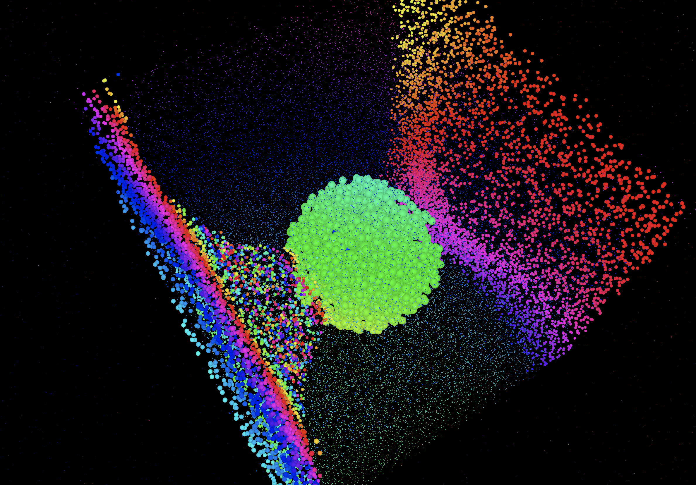

## Demo

Main: https://dman7.github.io/djviz/visualizations/viz.html

Experimental shapes:
https://dman7.github.io/djviz/visualizations/dotcube_experiment_scale.html
https://dman7.github.io/djviz/visualizations/dotcube_freq_scale.html
https://dman7.github.io/djviz/visualizations/dotcube_linear_freq_scale.html
https://dman7.github.io/djviz/visualizations/dotcube_sin_scale.html
https://dman7.github.io/djviz/visualizations/dotcube_torus_scale.html


## Explanation



## Instructions

1. Add

```
<script type="text/javascript" src="./microphoneStreamer.js"></script>
<script type="text/javascript" src="./dotcubeInitializer.js"></script>
```

to HTML file. E.g. file:///opt/djviz/visualizations/dotcube_torus_scale.html

2. Open the file in Google Chrome browser. E.g file:///opt/djviz/visualizations/dotcube_torus_scale.html

3. Click "Start Recording from Mic"

4. Click "Accept"

5. Play any song & you'll see the viz.

6. Optional: if you have Soundflower, change your computer's Input source to be SoundFlower. Should be lossless.


## Credits
3D library three.js: https://threejs.org/  
Original microphone streamer code credits to this guy: // https://stackoverflow.com/questions/27846392/access-microphone-from-a-browser-javascript
